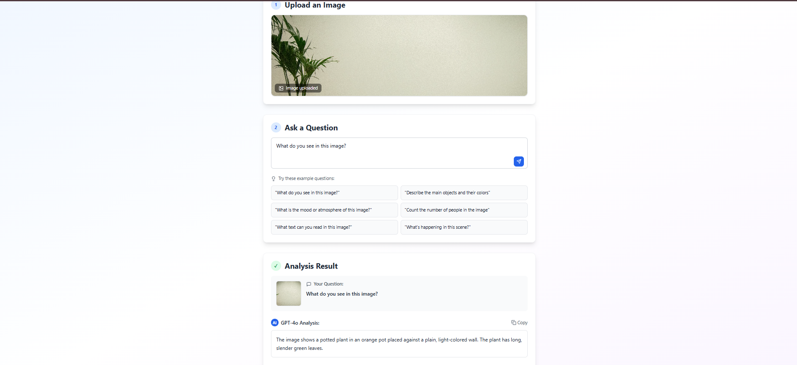

# 🤖 Multimodal QA Agent

A beautiful web application that combines image analysis with natural language processing using GPT-4o Vision. Upload an image, ask a question, and get intelligent insights powered by OpenAI's latest multimodal AI.



## ✨ Features

- 🖼️ **Image Upload**: Drag & drop or click to upload images (JPG, PNG, GIF, WebP)
- 🤔 **Smart Questions**: Ask any question about your images
- 🧠 **GPT-4o Vision**: Powered by OpenAI's most advanced multimodal model
- 💅 **Beautiful UI**: Modern, responsive design with smooth animations
- ⚡ **Real-time Analysis**: Fast image processing and response generation
- 📱 **Mobile Friendly**: Works seamlessly on all devices

## 📸 Demo Output

Here's an example of the application in action:


*The interface shows the clean, modern design with drag-and-drop image upload, intelligent question suggestions, and detailed AI-powered responses from GPT-4o Vision.*

## 🏗️ Architecture

```
├── backend/           # Flask API server
│   ├── app.py        # Main Flask application
│   ├── requirements.txt
│   └── .env.example
└── frontend/         # React + Vite client
    ├── src/
    │   ├── components/
    │   ├── App.jsx
    │   └── main.jsx
    ├── package.json
    └── vite.config.js
```

## 🚀 Quick Start

### Prerequisites

- Python 3.8+
- Node.js 16+
- OpenAI API Key

### Backend Setup

1. **Navigate to backend directory**
   ```bash
   cd backend
   ```

2. **Create virtual environment**
   ```bash
   python -m venv venv
   ```

3. **Activate virtual environment**
   ```bash
   # Windows
   venv\\Scripts\\activate
   
   # macOS/Linux
   source venv/bin/activate
   ```

4. **Install dependencies**
   ```bash
   pip install -r requirements.txt
   ```

5. **Configure environment variables**
   ```bash
   # Copy the example file
   copy .env.example .env
   
   # Edit .env and add your OpenAI API key
   OPENAI_API_KEY=your_actual_api_key_here
   ```

6. **Run the Flask server**
   ```bash
   python app.py
   ```
   
   Server will start at `http://localhost:5000`

### Frontend Setup

1. **Navigate to frontend directory**
   ```bash
   cd frontend
   ```

2. **Install dependencies**
   ```bash
   npm install
   ```

3. **Start development server**
   ```bash
   npm run dev
   ```
   
   Frontend will start at `http://localhost:3000`

## 🎯 Usage

1. **Upload an Image**: Drag and drop or click to select an image file
2. **Ask a Question**: Type your question or use one of the example prompts
3. **Get AI Insights**: Watch as GPT-4o analyzes your image and provides detailed responses
4. **Copy & Share**: Copy the AI response or ask follow-up questions

### Example Questions

- "What do you see in this image?"
- "Describe the main objects and their colors"
- "What is the mood or atmosphere of this image?"
- "Count the number of people in the image"
- "What text can you read in this image?"
- "What's happening in this scene?"

## 🧪 Test Cases

### Test Case 1: Object Detection
- **Image**: Street scene with cars and pedestrians
- **Question**: "How many cars can you see in this image?"
- **Expected**: Accurate count with description of vehicle types

### Test Case 2: Text Recognition
- **Image**: Sign or document with visible text
- **Question**: "What text can you read in this image?"
- **Expected**: Accurate transcription of visible text

### Test Case 3: Scene Analysis
- **Image**: Nature landscape
- **Question**: "Describe the weather and time of day"
- **Expected**: Analysis of lighting, shadows, and atmospheric conditions

## 🛠️ API Endpoints

### POST `/api/analyze`

Analyzes an uploaded image with a question.

**Request:**
- Method: `POST`
- Content-Type: `multipart/form-data`
- Parameters:
  - `image`: Image file (required)
  - `question`: Text question (optional, defaults to "What do you see in this image?")

**Response:**
```json
{
  "success": true,
  "answer": "I can see a beautiful sunset over a mountain range...",
  "question": "What do you see in this image?"
}
```

**Error Response:**
```json
{
  "success": false,
  "error": "No image provided"
}
```

## 🎨 Technology Stack

### Backend
- **Flask**: Lightweight Python web framework
- **OpenAI API**: GPT-4o Vision for image analysis
- **Flask-CORS**: Cross-origin resource sharing
- **python-dotenv**: Environment variable management

### Frontend
- **React 18**: Modern UI library
- **Vite**: Fast build tool and dev server
- **Tailwind CSS**: Utility-first CSS framework
- **Lucide React**: Beautiful icon library
- **React Dropzone**: Drag & drop file uploads
- **Axios**: HTTP client for API calls

## 🔧 Configuration

### Environment Variables

Create a `.env` file in the backend directory:

```env
OPENAI_API_KEY=sk-your-api-key-here
FLASK_ENV=development
FLASK_DEBUG=True
```

### Vite Proxy Configuration

The frontend is configured to proxy API requests to the Flask backend:

```javascript
// vite.config.js
export default defineConfig({
  server: {
    proxy: {
      '/api': {
        target: 'http://localhost:5000',
        changeOrigin: true,
      }
    }
  }
})
```

## 🚀 Deployment

### Backend Deployment (Heroku)

1. Create `Procfile`:
   ```
   web: python app.py
   ```

2. Update Flask app for production:
   ```python
   if __name__ == "__main__":
       port = int(os.environ.get("PORT", 5000))
       app.run(host='0.0.0.0', port=port)
   ```

### Frontend Deployment (Vercel)

1. Build the project:
   ```bash
   npm run build
   ```

2. Deploy to Vercel:
   ```bash
   vercel --prod
   ```

## 🤝 Contributing

1. Fork the repository
2. Create a feature branch: `git checkout -b feature-name`
3. Commit changes: `git commit -am 'Add feature'`
4. Push to branch: `git push origin feature-name`
5. Submit a Pull Request

## 📝 License

This project is licensed under the MIT License. See [LICENSE](LICENSE) file for details.

## 🙏 Acknowledgments

- [OpenAI](https://openai.com/) for the incredible GPT-4o Vision model
- [React](https://reactjs.org/) and [Vite](https://vitejs.dev/) teams for excellent developer tools
- [Tailwind CSS](https://tailwindcss.com/) for the beautiful styling system

## 📞 Support

If you encounter any issues or have questions:

1. Check the [Issues](https://github.com/username/multimodal-qa-agent/issues) page
2. Create a new issue with detailed description
3. Include error messages and steps to reproduce

---

Made with ❤️ using React, Flask, and GPT-4o Vision
