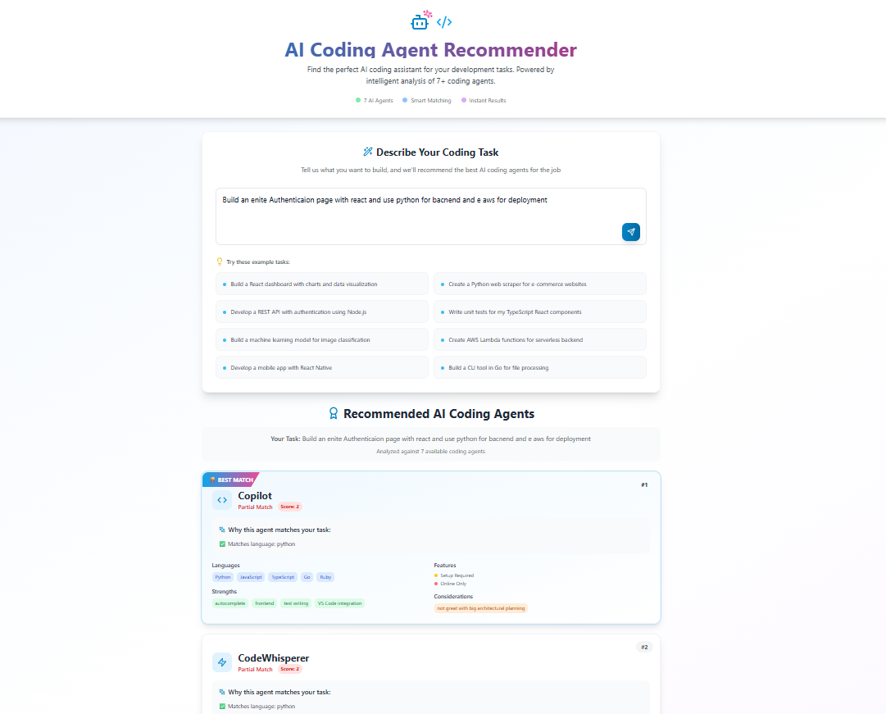
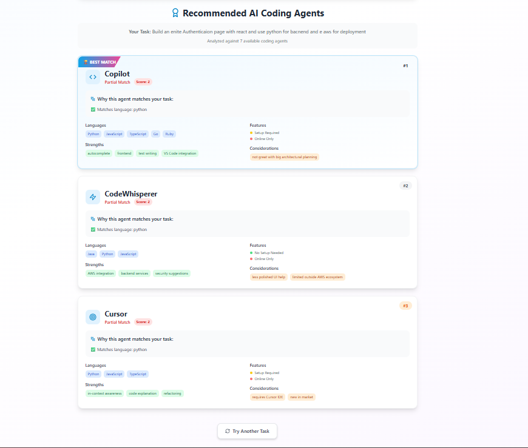

# 🤖 AI Coding Agent Recommendation System

An intelligent web application that analyzes your coding tasks and recommends the best AI coding assistants for the job. Get personalized recommendations from 7+ top coding agents including GitHub Copilot, AWS CodeWhisperer, Cursor, and more.



## ✨ Features

- 🎯 **Smart Task Analysis**: Natural language processing of coding requirements
- 🤖 **7 AI Agents**: Comprehensive database of coding assistants
- 📊 **Intelligent Scoring**: Advanced algorithm that matches tasks to agent capabilities
- 💡 **Detailed Explanations**: Clear reasoning for each recommendation
- 🎨 **Beautiful UI**: Modern, responsive interface with smooth animations
- ⚡ **Instant Results**: Fast recommendations with detailed comparisons

## 📸 Live Demo

Here's the application in action, showing the intelligent recommendation system at work:



*The interface displays personalized recommendations with detailed scoring, explanations, and comprehensive agent information to help developers make informed decisions.*

## 🏗️ Architecture

```
├── backend/
│   ├── app.py              # Flask API server
│   ├── recommender.py      # Recommendation engine
│   ├── agents_data.py      # Agent knowledge base
│   └── requirements.txt
├── frontend/
│   ├── src/
│   │   ├── components/     # React components
│   │   ├── App.jsx        # Main application
│   │   └── main.jsx       # Entry point
│   ├── package.json
│   └── vite.config.js
└── start_servers.bat      # Easy startup script
```

## 🤖 Supported AI Coding Agents

| Agent | Languages | Key Strengths | Setup Required |
|-------|-----------|---------------|----------------|
| **GitHub Copilot** | Python, JS, TS, Go, Ruby | VS Code integration, autocomplete, test writing | ✅ |
| **AWS CodeWhisperer** | Java, Python, JavaScript | AWS integration, security suggestions | ❌ |
| **Cursor** | Python, JS, TS | In-context awareness, code explanation | ✅ |
| **Replit** | Python, JS, C++, Java | Instant dev environment, multiplayer | ❌ |
| **Tabnine** | Python, JS, Java, C#, C++ | Local inference, privacy-friendly | ✅ |
| **Amazon Q** | Java, Python, JS, TS | Enterprise context, AWS-focused | ❌ |
| **CodeGeeX** | Python, Java, C++, JS | Multilingual, open-source friendly | ❌ |

## 🚀 Quick Start

### Prerequisites
- Python 3.8+
- Node.js 16+

### Option 1: Use Startup Script (Recommended)
```bash
# Double-click or run:
start_servers.bat
```

### Option 2: Manual Setup

#### Backend Setup
```bash
cd backend
pip install -r requirements.txt
python app.py
```

#### Frontend Setup
```bash
cd frontend
npm install
npm run dev
```

## 🎯 Usage

1. **Describe Your Task**: Enter a natural language description of your coding project
2. **Get Recommendations**: Receive top 3 AI agent recommendations with detailed scoring
3. **Compare Features**: View languages, strengths, weaknesses, and setup requirements
4. **Make Your Choice**: Use the explanations to select the best agent for your needs

### Example Tasks

- "Build a React dashboard with charts and data visualization"
- "Create a Python web scraper for e-commerce websites"
- "Develop a REST API with authentication using Node.js"
- "Write unit tests for my TypeScript React components"
- "Build a machine learning model for image classification"

## 🎨 User Interface

The application features a modern, intuitive interface designed for optimal user experience:

### Main Dashboard

*Clean, professional design with easy task input and example prompts to get started quickly.*

### Recommendation Results  

*Detailed recommendations with scoring explanations, agent capabilities, and feature comparisons.*

## 🔍 How It Works

### Scoring Algorithm

The recommendation engine analyzes your task description and scores each agent based on:

- **Language Match** (+2 points): Direct language compatibility
- **Strength Alignment** (+2 points): Agent specialties matching your needs  
- **Ideal Task Match** (+3 points): Perfect use case alignment
- **Weakness Penalty** (-3 points): Known limitations for your task type
- **Feature Bonuses** (+1 point): Special capabilities like offline support

### Recommendation Logic

1. **Text Analysis**: Extract keywords from task description
2. **Agent Matching**: Compare against agent capabilities database
3. **Score Calculation**: Apply weighted scoring algorithm
4. **Ranking**: Sort by compatibility score
5. **Explanation**: Generate detailed reasoning for each match

## 🛠️ API Endpoints

### POST `/recommend`
Analyzes a task and returns top 3 agent recommendations.

**Request:**
```json
{
  "task": "Build a React dashboard with real-time data"
}
```

**Response:**
```json
{
  "task": "Build a React dashboard with real-time data",
  "recommendations": [
    {
      "name": "Copilot",
      "score": 7,
      "explanation": [
        "✅ Matches language: react",
        "✅ Matches strength: frontend"
      ],
      "agent_info": {
        "languages": ["JavaScript", "TypeScript"],
        "strengths": ["frontend", "autocomplete"],
        "requires_setup": true,
        "offline_support": false
      }
    }
  ],
  "total_agents": 7
}
```

### GET `/agents`
Returns information about all available agents.

### GET `/`
Health check endpoint.

## 🎨 Technology Stack

### Backend
- **Flask**: Lightweight Python web framework
- **Flask-CORS**: Cross-origin resource sharing
- **Custom Algorithm**: Intelligent scoring and matching

### Frontend
- **React 18**: Modern UI library
- **Vite**: Fast build tool and dev server
- **Tailwind CSS**: Utility-first CSS framework
- **Framer Motion**: Smooth animations
- **Lucide React**: Beautiful icons
- **Axios**: HTTP client

## 📊 Scoring Examples

**Task: "Build a React frontend with TypeScript"**
- Copilot: 7 points (JS+2, TS+2, frontend+2, autocomplete+1)
- Cursor: 5 points (JS+2, TS+2, code explanation+1)
- CodeWhisperer: 2 points (JS+2)

**Task: "Create AWS Lambda functions"**
- CodeWhisperer: 8 points (AWS+3, backend+2, IAM+3)
- Amazon Q: 6 points (AWS+3, backend+2, enterprise+1)
- Copilot: 2 points (Python+2)

## 🚀 Deployment

### Backend (Flask)
```bash
# For production
pip install gunicorn
gunicorn -w 4 -b 0.0.0.0:5000 app:app
```

### Frontend (React)
```bash
# Build for production
npm run build

# Deploy to Vercel/Netlify
npm run preview
```

## 🤝 Contributing

1. Fork the repository
2. Create a feature branch: `git checkout -b feature-name`
3. Add new agents to `agents_data.py`
4. Improve scoring algorithm in `recommender.py`
5. Submit a pull request

### Adding New Agents

```python
"NewAgent": {
    "languages": ["Language1", "Language2"],
    "strengths": ["strength1", "strength2"],
    "weaknesses": ["weakness1"],
    "ideal_tasks": ["task1", "task2"],
    "requires_setup": True/False,
    "offline_support": True/False
}
```

## 📈 Future Enhancements

- [ ] **User Accounts**: Save favorite agents and task history
- [ ] **Advanced Filtering**: Filter by setup requirements, offline support
- [ ] **Integration Guide**: Step-by-step setup instructions for each agent
- [ ] **Community Ratings**: User feedback and ratings
- [ ] **More Agents**: Expand to include newer AI coding assistants
- [ ] **Project Templates**: Pre-configured setups for different project types

## 📝 License

This project is licensed under the MIT License.

## 🙏 Acknowledgments

- GitHub Copilot, AWS CodeWhisperer, Cursor, and other AI coding tools
- React and Vite teams for excellent developer experience
- Tailwind CSS for beautiful styling system

---

Made with ❤️ for developers choosing the right AI coding assistant
